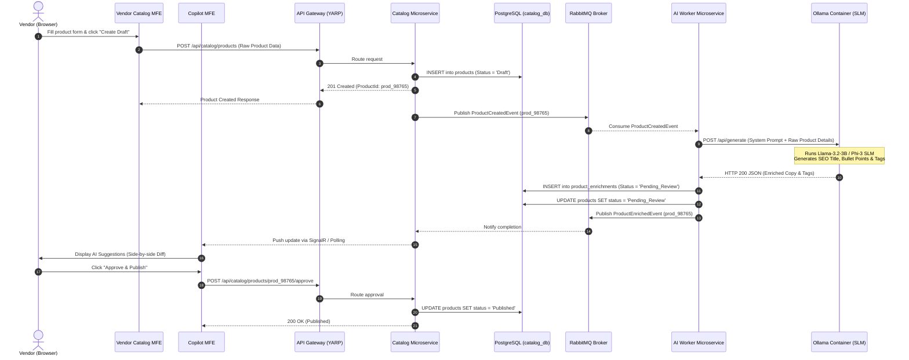
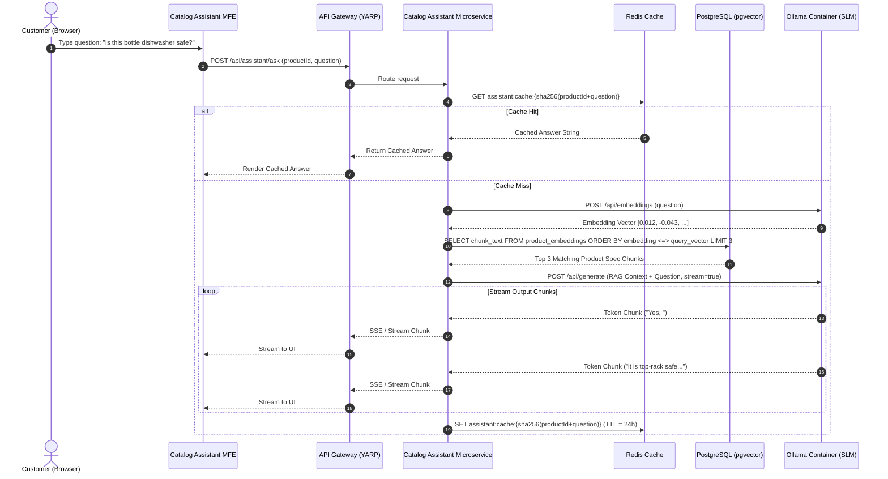

# Architecture Sequence Diagrams

This document contains detailed sequence diagrams for the key end-to-end workflows of the **E-Commerce Smart Merchandising & Catalog AI Platform**.

---

## 1. Vendor Product Creation & Async AI Merchandising Workflow

This workflow illustrates how a vendor submits a raw product entry, which is then asynchronously processed by the `.NET 8 AI Worker` microservice using the containerized `Ollama SLM`, and presented to the vendor for review in the `Copilot MFE`.

---

## 2. Catalog Assistant (RAG & Vector Search) Workflow

This workflow illustrates how a customer asks a question on a product detail page, which executes a vector similarity search over `pgvector` and streams the response from the `Ollama SLM` with Redis prompt caching.

